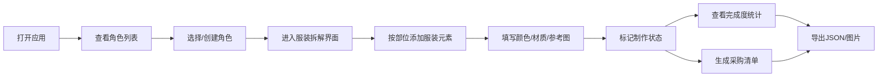

## 1. 产品概述

角色服装设定拆解工具是一款面向coser和画手的资料整理工具，帮助用户系统地记录和管理角色服装的各个元素，提升制作效率和准确性。

- **核心用途**：按部位拆解服装元素，记录颜色、材质、制作难度、参考图等详细信息
- **目标用户**：COSPLAY玩家、原画设计师、服装设计师、同人创作者
- **产品价值**：将零散的服装资料系统化，便于追踪制作进度、生成采购清单、团队协作

## 2. 核心功能

### 2.1 用户角色

| 角色 | 注册方式 | 核心权限 |
|------|----------|----------|
| 普通用户 | 无需注册，直接使用 | 创建/编辑/删除角色档案、导出数据、本地存储 |

### 2.2 功能模块

1. **角色档案管理**：角色列表、创建/编辑/删除角色、角色基本信息
2. **服装拆解编辑**：按部位分类（头部/上衣/下装/鞋袜/配饰/武器）、元素详情编辑
3. **筛选与统计**：部位标签筛选、完成度统计可视化
4. **采购清单**：自动生成待采购/待制作清单
5. **数据导出**：导出为JSON文件、导出为图片
6. **本地存储**：所有数据保存在浏览器localStorage

### 2.3 页面详情

| 页面名称 | 模块名称 | 功能描述 |
|----------|----------|----------|
| 主页面 | 侧边栏导航 | 角色列表切换、新建角色按钮、统计概览 |
| 主页面 | 角色信息区 | 角色名称、作品来源、角色简介、完成度进度条 |
| 主页面 | 服装拆解区 | 部位标签筛选、元素卡片列表、新增元素按钮 |
| 主页面 | 元素编辑面板 | 颜色/材质/难度/参考图/备注等字段编辑 |
| 主页面 | 采购清单面板 | 待采购物品列表、勾选状态、导出功能 |
| 主页面 | 导出功能区 | JSON导出、图片导出按钮 |

## 3. 核心流程

用户打开应用后，首先看到角色列表（默认有示例角色），选择或创建角色后进入服装拆解界面。用户按部位添加服装元素，填写详细信息并标记状态，系统自动统计完成度并生成采购清单，最后可导出数据。

## 4. 用户界面设计

### 4.1 设计风格

**设计方向：创意工作室风（Art Studio Style）**

- **主色调**：深靛蓝 (#1a1a2e) 作为背景色，营造专业创作氛围
- **辅助色**：珊瑚橙 (#ff6b6b) 作为强调色，用于按钮和重要操作
- **点缀色**：薄荷绿 (#4ecdc4) 表示完成状态，琥珀黄 (#ffd93d) 表示待确认
- **字体**：标题使用 "Noto Serif SC" 衬线字体体现文艺感，正文使用 "Noto Sans SC" 保证可读性
- **按钮风格**：微圆角 (8px)、微妙阴影、悬停时有轻微上浮和颜色加深效果
- **布局风格**：三栏布局（左侧导航 + 中间内容区 + 右侧详情面板）
- **卡片设计**：白色卡片带轻微阴影，悬浮时有放大和阴影加深动画
- **图标风格**：线性图标 + 微妙渐变填充，统一24px尺寸

### 4.2 页面设计概览

| 页面名称 | 模块名称 | UI Elements |
|----------|----------|-------------|
| 主页面 | 侧边栏 | 深色背景、角色卡片列表、滚动动画、新增按钮悬浮效果 |
| 主页面 | 顶部栏 | 角色名称输入、作品来源标签、完成度环形进度条、导出按钮组 |
| 主页面 | 部位筛选栏 | 胶囊形标签按钮、选中态高亮、平滑过渡动画 |
| 主页面 | 元素卡片网格 | 响应式网格布局、卡片悬浮动画、状态角标 |
| 主页面 | 编辑面板 | 滑入动画、分组表单、颜色选择器、图片预览 |
| 主页面 | 采购清单 | 可折叠面板、复选框动画、进度条、拖拽排序 |

### 4.3 响应式设计

- **Desktop (>1024px)**：三栏完整布局，侧边栏固定宽度280px，详情面板320px
- **Tablet (768-1024px)**：两栏布局，侧边栏可折叠，详情面板改为底部抽屉
- **Mobile (<768px)**：单栏布局，底部导航切换视图，采用抽屉式面板

### 4.4 交互与动画

- 页面加载时元素按序淡入（staggered reveal），延迟50ms递增
- 卡片悬浮时 scale(1.02) + 阴影加深，过渡时长200ms
- 侧边栏折叠/展开使用 cubic-bezier(0.4, 0, 0.2, 1) 缓动
- 进度条动画使用 ease-out，时长600ms
- 表单验证错误时轻微抖动效果
