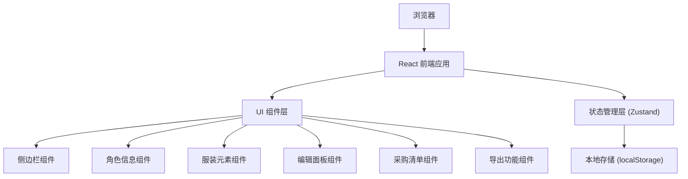

## 1. 架构设计



## 2. 技术描述

- **前端框架**: React@18 + TypeScript
- **构建工具**: Vite@5
- **样式方案**: TailwindCSS@3
- **状态管理**: Zustand (轻量级状态管理)
- **图标库**: lucide-react
- **图片导出**: html2canvas
- **字体**: Google Fonts (Noto Serif SC, Noto Sans SC)

## 3. 数据结构定义

### 3.1 角色数据模型

```typescript
// 服装部位枚举
type ClothingCategory = 'head' | 'top' | 'bottom' | 'shoes' | 'accessory' | 'weapon';

// 制作难度
type DifficultyLevel = 'easy' | 'medium' | 'hard' | 'expert';

// 制作状态
type ProductionStatus = 'pending' | 'confirmed' | 'in_progress' | 'completed';

// 服装元素
interface ClothingElement {
  id: string;
  name: string;
  category: ClothingCategory;
  colors: string[];
  materials: string[];
  difficulty: DifficultyLevel;
  referenceImages: string[];
  notes: string;
  questions: string;
  status: ProductionStatus;
  needToBuy: boolean;
  createdAt: number;
  updatedAt: number;
}

// 角色档案
interface Character {
  id: string;
  name: string;
  source: string;
  description: string;
  elements: ClothingElement[];
  createdAt: number;
  updatedAt: number;
}

// 应用状态
interface AppState {
  characters: Character[];
  activeCharacterId: string | null;
  selectedCategory: ClothingCategory | 'all';
}
```

### 3.2 本地存储键名
- localStorage key: `cosplay-costume-analyzer-data

## 4. 组件结构

```
src/
├── components/
│   ├── Sidebar/
│   │   ├── Sidebar.tsx          # 侧边栏容器
│   │   ├── CharacterList.tsx  # 角色列表
│   │   └── CharacterCard.tsx  # 角色卡片
│   │   └── NewCharacterButton.tsx
│   ├── Header/
│   │   ├── Header.tsx         # 顶部信息栏
│   │   ├── ProgressRing.tsx  # 完成度环形进度
│   │   └── ExportButtons.tsx
│   ├── ClothingGrid/
│   │   ├── CategoryFilter.tsx # 部位筛选
│   │   ├── ElementCard.tsx   # 元素卡片
│   │   └── AddElementButton.tsx
│   ├── EditorPanel/
│   │   ├── EditorPanel.tsx    # 编辑面板
│   │   ├── ColorPicker.tsx   # 颜色选择
│   │   └── ImageUploader.tsx # 图片预览
│   └── ShoppingList/
│       ├── ShoppingList.tsx     # 采购清单
│       └── ShoppingItem.tsx
├── store/
│   └── useStore.ts          # Zustand store
├── utils/
│   ├── storage.ts            # 本地存储工具
│   └── export.ts           # 导出工具
├── types/
│   └── index.ts
├── data/
│   └── sampleData.ts          # 示例数据
├── App.tsx
├── main.tsx
└── index.css
```

## 5. 功能实现要点

### 5.1 本地存储
- 初始化时从localStorage加载数据
- 数据变更时自动保存
- 提供导出/导入JSON功能

### 5.2 导出功能
- JSON导出：直接下载JSON文件
- 图片导出：使用html2canvas将页面截图

### 5.3 完成度统计
- 按分类统计元素数量
- 按状态统计完成比例
- 可视化环形进度条

### 5.4 采购清单生成
- 筛选needToBuy为true的元素
- 支持勾选标记
- 按分类分组显示
